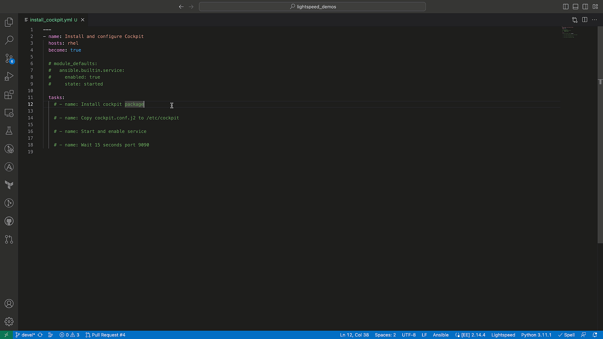

# Install and configure Cockpit

## Configure and activate Ansible Lightspeed

Install the VS Code extension and activate Ansible Lightspeed using resources in the [getting started guide](../../../getting_started.md).

## ❗️Test examples before doing a demo

The model continues to improve and evolve with each release and generated suggestions could differ from the examples provided.

### Tested content is available in the corresponding `solutions` folder

Tested Ansible content is available in the [solutions](./solutions/) folder. Please use this to compare your generated suggestions to the tested Ansible content.

## Overview

This Playbook installs Cockpit, copies a custom Cockpit configuration file, and starts the cockpit service.  

The demo illustrates:

* How Ansible Lightspeed uses the full Playbook context by generating a task based on the `module_defaults` Playbook section.
* Uses a generic task prompt to generate Ansible content based on the existing Playbook context.



## Demo preparation

1. Create an Ansible Inventory file with the `rhel` group with the corresponding Linux target host(s).

- [Example Ansible inventory file](./inventory/inventory.yml)

```yaml
---
all:
  children:
    rhel:
      hosts:
        rhel-01:
          ansible_host: "Your Ansible target host"
  vars:
    ansible_ssh_private_key_file: 'Your SSH private key file'
    ansible_user: 'Your Ansible user'
    ansible_host_key_checking: false
```

## Running the demo

### Demo content

#### Initial Ansible Playbook

[./playbooks/infra/install_cockpit/install_cockpit.yml](./install_cockpit.yml)

#### Tested Ansible Playbook

[./playbooks/infra/install_cockpit/solutions/install_cockpit.yml](./solutions/install_cockpit.yml)

Run the steps below in the [./playbooks/infra/install_cockpit/install_cockpit.yml](./install_cockpit.yml) example Ansible Playbook.

### Step 1

#### Uncomment and generate first task `- name: Install cockpit package`

* Used natural language prompt to generate syntactically correct Ansible Playbook task.
* Suggestion incorporated Ansible best practices and used Fully Qualified Collection Name (FQCN).

### Step 2

#### Uncomment and generate task `- name: Copy cockpit.conf.j2 to /etc/cockpit`

* Ansible Lightspeed used `ansible.builtin.template` module based on the `.j2` file extension.
* The suggestion set the file permissions, owner, and group based on Ansible best practices.

### Step 3

#### Uncomment and generate task `- name: Start and enable service`

* Ansible Lightspeed used the generic `Start and enable service` prompt and the full Playbook context to infer the user needed to start the `cockpit` service.

### Step 4

#### Uncomment and generate task `- name: Wait 15 seconds port 9090`

* Ansible Lightspeed used the specific values requested in the prompt.

### Step 5

#### Uncomment the module_defaults section

```yaml
  module_defaults:
    ansible.builtin.service:
      enabled: true
      state: started
```

### Step 6

#### Clear current task and request updated suggestion for `- name: Start and enable service`

* Ansible Lightspeed used the full Playbook context and included the `module_defaults` Playbook entry when generating a suggestion.
* Note that the suggestion no longer includes `enabled: true` and `state: started` as it's already declared in the `module_defaults` section.

---
