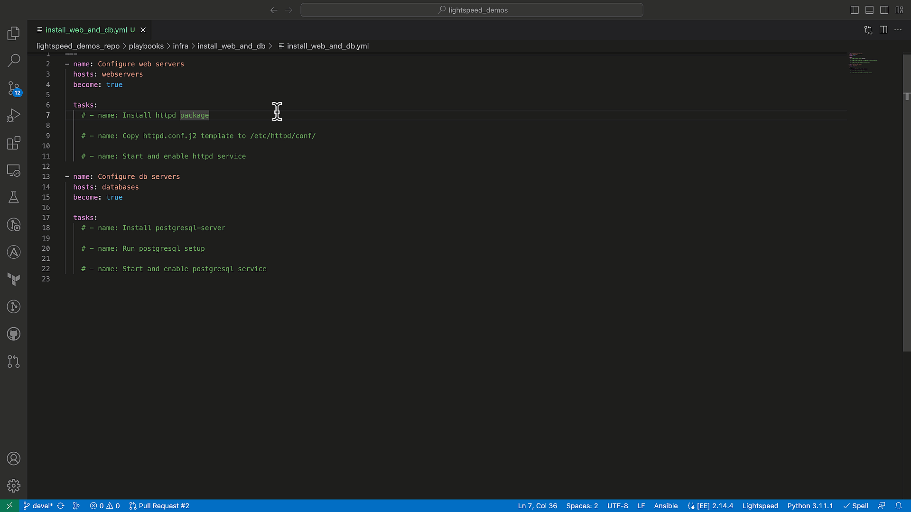

# Install and configure Apache web server and PostgreSQL

## ❗️Note

### Test the examples prior to performing a demo

The IBM Watson Code Assistant model continues to improve and evolve with each release. This can result in generated suggestions that differ from the examples provided.

### Tested content is available in the corresponding `solutions` folder

Tested Ansible content is available in the [solutions](./solutions/) folder. Please use this to compare your generated suggestions to the tested Ansible content.

## Overview

- The first Ansible Play installs `httpd`, copies a custom Apache configuration file with the correct file permissions, and starts and enables the `httpd` service.
- The second Ansible Play installs `postgresql-server`, initializes the database, and starts and enables the `postgresql` service.



## Demo preparation

1. Install the Ansible VS Code extension and activate Ansible Lightspeed. Below are resources to get started:

- [Ansible Lightspeed Technical Preview blog](https://www.ansible.com/blog/welcome-to-the-ansible-lightspeed-technical-preview).
- [Ansible Lightspeed Technical Preview video](https://youtu.be/yfXcGB7l0II).

2. Create an Ansible Inventory file with `webservers` and `databases` group with the corresponding Linux target host(s).

- [Example Ansible inventory file](./inventory/inventory.yml)

```yaml
---
all:
  children:
    webservers:
      hosts:
        webserver-01:
          ansible_host: "Your Ansible target host"
    databases:
      hosts:
        database-01:
          ansible_host: "Your Ansible target host"
  vars:
    ansible_ssh_private_key_file: 'Your SSH private key file'
    ansible_user: 'Your Ansible user'
    ansible_host_key_checking: false

```

## Running the demo

### Demo content

#### Initial Ansible Playbook

[./playbooks/infra/install_web_and_db/install_web_and_db.yml](./install_web_and_db.yml)

#### Tested Ansible Playbook

[./playbooks/infra/install_web_and_db/solutions/install_web_and_db.yml](./solutions/install_web_and_db.yml)

Run the steps below in the [./playbooks/infra/install_web_and_db/install_web_and_db.yml](./install_web_and_db.yml) example Ansible Playbook.

### Step 1

#### **In the first Ansible play**

#### Uncomment and generate first task `- name: Install httpd package`

- Used natural language prompt to generate syntactically correct Ansible Playbook task.
- Suggestion incorporated Ansible best practices and used Fully Qualified Collection Name (FQCN).

### Step 2

#### Uncomment and generate task `- name: Copy httpd.conf.j2 template to /etc/httpd/conf/`

- Ansible Lightspeed suggestion used best practices and defined the file permissions, owner and group in the module arguments.

### Step 3

#### Uncomment and generate task `- name: Start and enable httpd service`

- Ansible Lightspeed used natural language prompt and added `state: started` and `enabled: true` module arguments based on `Start and enable...` in the Ansible task description.

### **In the second Ansible play**

### Step 4

#### Uncomment and generate task `- name: Install postgresql-server`

### Step 5

#### Uncomment and generate task `- name: Run postgresql setup`

- Ansible Lightspeed used an easy-to-understand natural language prompt and suggested the correct, more complex PostgreSQL CLI command to initiate the database.
- Ansible Lightspeed used best practices and kept the task idempotent by including `creates: /var/lib/pgsql/data/postgresql.conf` in the suggestion.

### Step 6

#### Uncomment and generate task `- name: Start and enable postgresql service`

---
